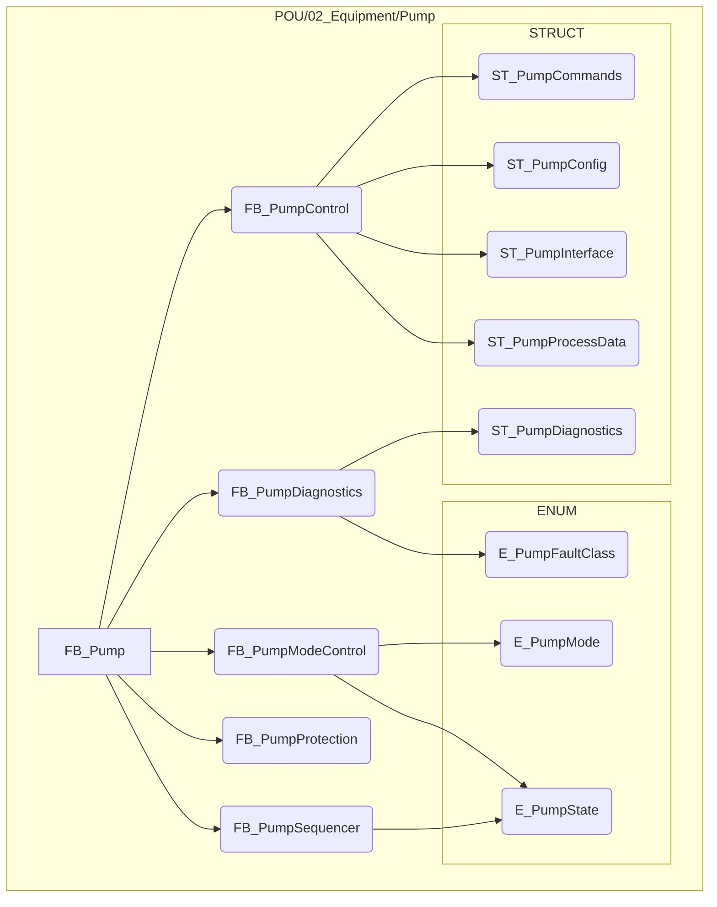
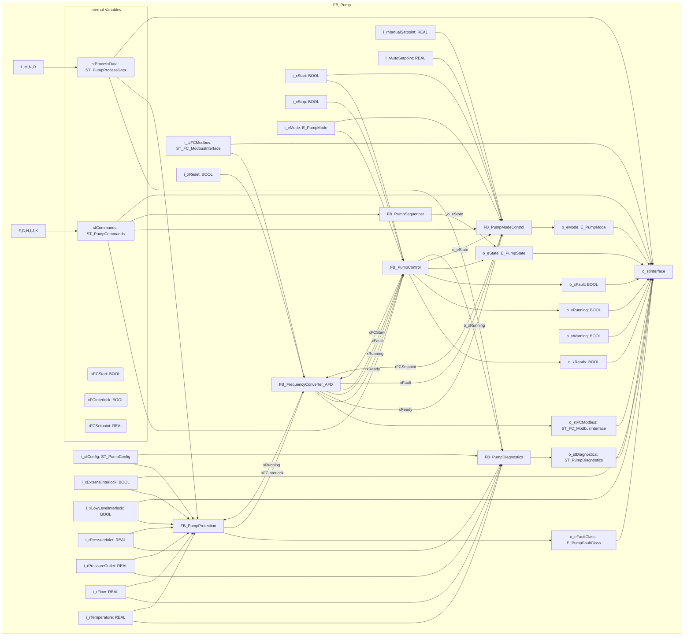
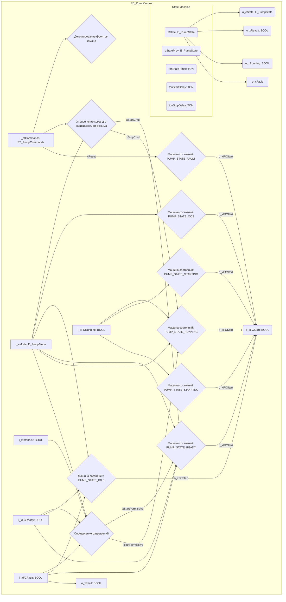
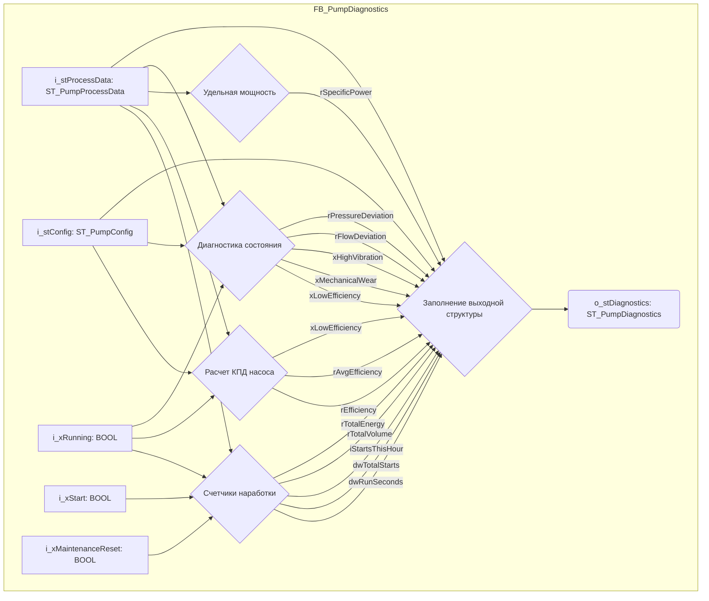

# Архитектура и структура модуля "Насос" (Pump)

Данный документ описывает архитектуру и структуру папки `Project/POU/02_Equipment/Pump` и входящих в нее функциональных блоков (ФБ).

## Обзор

Модуль "Насос" (`Pump`) инкапсулирует всю логику управления, диагностики и защиты насосного оборудования. Основным функциональным блоком является `FB_Pump`, который координирует работу других специализированных ФБ.

## Структура папки `Project/POU/02_Equipment/Pump`



## Описание функциональных блоков (ФБ)

*   **FB_Pump**: Главный функциональный блок, агрегирующий и координирующий работу всех под-ФБ для управления насосом.
*   **FB_PumpControl**: Отвечает за непосредственное управление насосом, включая команды пуска/останова, регулирование скорости и т.д. Взаимодействует со структурами команд и конфигурации.
*   **FB_PumpDiagnostics**: Обрабатывает диагностические данные и определяет состояние неисправностей насоса. Использует структуры диагностики и перечисления классов неисправностей.
*   **FB_PumpModeControl**: Управляет режимами работы насоса (например, ручной, автоматический) и его состояниями. Использует перечисления режимов и состояний.
*   **FB_PumpProtection**: Реализует логику защиты насоса от перегрузок, сухого хода и других аварийных ситуаций.
*   **FB_PumpSequencer**: Отвечает за последовательность операций насоса, например, при запуске или останове.

## Описание типов данных (ENUM и STRUCT)

### ENUM (Перечисления)

*   **E_PumpFaultClass**: Определяет классы неисправностей насоса.
*   **E_PumpMode**: Определяет доступные режимы работы насоса.
*   **E_PumpState**: Определяет возможные состояния насоса (например, "Остановлен", "Работает", "Ошибка").

### STRUCT (Структуры)

*   **ST_PumpCommands**: Содержит команды управления, подаваемые на насос.
*   **ST_PumpConfig**: Содержит параметры конфигурации насоса.
*   **ST_PumpDiagnostics**: Содержит диагностические данные насоса.
*   **ST_PumpInterface**: Определяет общий интерфейс для взаимодействия с насосом.
*   **ST_PumpProcessData**: Содержит данные процесса, связанные с работой насоса (например, текущая скорость, давление).

## Детальное описание функциональных блоков

### FB_Pump

Главный функциональный блок, агрегирующий и координирующий работу всех под-ФБ для управления насосом.

#### Входы (VAR_INPUT)

| Имя переменной | Тип данных | Описание |
|---|---|---|
| i_xStart | BOOL | Команда пуска |
| i_xStop | BOOL | Команда останова |
| i_xReset | BOOL | Сброс ошибок |
| i_eMode | E_PumpMode | Режим работы |
| i_rManualSetpoint | REAL | Ручная уставка частоты, Гц |
| i_rAutoSetpoint | REAL | Автоматическая уставка |
| i_rPressureInlet | REAL | Давление на входе, бар |
| i_rPressureOutlet | REAL | Давление на выходе, бар |
| i_rFlow | REAL | Расход, м?/ч |
| i_rTemperature | REAL | Температура, °C |
| i_stFCModbus | ST_FC_ModbusInterface | Интерфейс Modbus ПЧ |
| i_xExternalInterlock | BOOL | Внешняя блокировка |
| i_xLowLevelInterlock | BOOL | Блокировка по уровню |
| i_stConfig | ST_PumpConfig | Конфигурация насоса |

#### Выходы (VAR_OUTPUT)

| Имя переменной | Тип данных | Описание |
|---|---|---|
| o_xReady | BOOL | Готов к работе |
| o_xRunning | BOOL | Работает |
| o_xFault | BOOL | Авария |
| o_xWarning | BOOL | Предупреждение |
| o_eState | E_PumpState | Состояние насоса |
| o_eMode | E_PumpMode | Текущий режим |
| o_eFaultClass | E_PumpFaultClass | Класс ошибки |
| o_stDiagnostics | ST_PumpDiagnostics | Диагностика |
| o_stFCModbus | ST_FC_ModbusInterface | Интерфейс Modbus ПЧ |
| o_stInterface | ST_PumpInterface | Полный интерфейс |

#### Внутренние переменные (VAR)

| Имя переменной | Тип данных | Описание |
|---|---|---|
| fbPumpControl | FB_PumpControl | Внутренний функциональный блок |
| fbFrequencyConverter | FB_FrequencyConverter_AFD | Внутренний функциональный блок |
| fbPumpProtection | FB_PumpProtection | Внутренний функциональный блок |
| fbPumpDiagnostics | FB_PumpDiagnostics | Внутренний функциональный блок |
| fbPumpModeControl | FB_PumpModeControl | Внутренний функциональный блок |
| fbPumpSequencer | FB_PumpSequencer | Внутренний функциональный блок |
| stProcessData | ST_PumpProcessData | Внутренние данные |
| stCommands | ST_PumpCommands | Внутренние данные |
| stFCInterface | ST_FC_Interface | Внутренние данные |
| xFCStart | BOOL | |
| xFCInterlock | BOOL | |
| rFCSetpoint | REAL | |
| xFirstScan | BOOL | Флаги |

#### Потоки данных и взаимодействие



### FB_PumpControl

Отвечает за непосредственное управление насосом, включая команды пуска/останова, регулирование скорости и т.д. Взаимодействует со структурами команд и конфигурации.

#### Входы (VAR_INPUT)

| Имя переменной | Тип данных | Описание |
|---|---|---|
| i_stCommands | ST_PumpCommands | Команды управления |
| i_eMode | E_PumpMode | Текущий режим |
| i_xInterlock | BOOL | Блокировка от защит |
| i_xFCReady | BOOL | ПЧ готов |
| i_xFCRunning | BOOL | ПЧ работает |
| i_xFCFault | BOOL | Ошибка ПЧ |

#### Выходы (VAR_OUTPUT)

| Имя переменной | Тип данных | Описание |
|---|---|---|
| o_eState | E_PumpState | Состояние насоса |
| o_xFCStart | BOOL | Команда пуска ПЧ |
| o_xReady | BOOL | Готов к работе |
| o_xRunning | BOOL | Работает |
| o_xFault | BOOL | Авария |

#### Внутренние переменные (VAR)

| Имя переменной | Тип данных | Описание |
|---|---|---|
| eState | E_PumpState | Машина состояний |
| eStatePrev | E_PumpState | |
| tonStateTimer | TON | Таймеры |
| tonStartDelay | TON | |
| tonStopDelay | TON | |
| xStartCmd | BOOL | Флаги |
| xStopCmd | BOOL | |
| xStartRising | BOOL | |
| xStopRising | BOOL | |
| xStartPrev | BOOL | |
| xStopPrev | BOOL | |
| xStartPermissive | BOOL | Внутренние переменные |
| xRunPermissive | BOOL | |
| tStateTime | TIME | |

#### Потоки данных и взаимодействие



### FB_PumpDiagnostics

Обрабатывает диагностические данные и определяет состояние неисправностей насоса. Использует структуры диагностики и перечисления классов неисправностей.

#### Входы (VAR_INPUT)

| Имя переменной | Тип данных | Описание |
|---|---|---|
| i_stProcessData | ST_PumpProcessData | Данные процесса |
| i_stConfig | ST_PumpConfig | Конфигурация |
| i_xRunning | BOOL | Насос работает |
| i_xStart | BOOL | Импульс пуска |
| i_xMaintenanceReset | BOOL | Сброс счетчика ТО |

#### Выходы (VAR_OUTPUT)

| Имя переменной | Тип данных | Описание |
|---|---|---|
| o_stDiagnostics | ST_PumpDiagnostics | Структура диагностики |

#### Внутренние переменные (VAR)

| Имя переменной | Тип данных | Описание |
|---|---|---|
| tonRunTimer | TON | Таймеры |
| tonHourTimer | TON | |
| rtStartDetect | R_TRIG | |
| dwRunSeconds | DWORD | Счетчики и накопители |
| dwTotalStarts | DWORD | |
| iStartsThisHour | INT | |
| rTotalVolume | REAL | |
| rTotalEnergy | REAL | |
| rEfficiency | REAL | Расчетные параметры |
| rSpecificPower | REAL | |
| rFlowDeviation | REAL | |
| rPressureDeviation | REAL | |
| rSumEfficiency | REAL | Средние значения |
| rSumPower | REAL | |
| dwEfficiencyCount | DWORD | |
| xLowEfficiency | BOOL | Диагностические флаги |
| xHighVibration | BOOL | |
| xMechanicalWear | BOOL | |
| xFirstScan | BOOL | Вспомогательные |
| dwLastHour | DWORD | |
| rPowerFactor | REAL | |

#### Потоки данных и взаимодействие



### FB_PumpModeControl

Управляет режимами работы насоса (например, ручной, автоматический) и его состояниями. Использует перечисления режимов и состояний.

#### Входы (VAR_INPUT)

| Имя переменной | Тип данных | Описание |
|---|---|---|
| i_stCommands | ST_PumpCommands | Команды управления |
| i_eCurrentState | E_PumpState | Текущее состояние насоса |
| i_xFCReady | BOOL | ПЧ готов |
| i_xFCFault | BOOL | Ошибка ПЧ |

#### Выходы (VAR_OUTPUT)

| Имя переменной | Тип данных | Описание |
|---|---|---|
| o_eMode | E_PumpMode | Активный режим |
| o_xModeValid | BOOL | Режим валиден |
| o_rActiveSetpoint | REAL | Активная уставка |

#### Внутренние переменные (VAR)

| Имя переменной | Тип данных | Описание |
|---|---|---|
| eMode | E_PumpMode | Текущий режим |
| eModePrev | E_PumpMode | |
| eModeRequest | E_PumpMode | |
| tonModeChangeDelay | TON | Таймеры |
| xModeChangeRequest | BOOL | Флаги |
| xModeChangeAllowed | BOOL | |
| xModeChangeActive | BOOL | |
| rManualSetpoint | REAL | Уставки |
| rAutoSetpoint | REAL | |
| rActiveSetpoint | REAL | |

#### Потоки данных и взаимодействие

```mermaid
graph TD
    subgraph FB_PumpModeControl
        direction LR
        A[i_stCommands: ST_PumpCommands] --> B{Запрос на изменение режима}
        A --> C{Выбор активной уставки}

        D[i_eCurrentState: E_PumpState] --> E{Проверка возможности смены режима}

        F[i_xFCReady: BOOL] --> G{Проверка валидности режима}
        H[i_xFCFault: BOOL] --> G

        B -- eModeRequest --> E
        B -- xModeChangeRequest --> I{Выполнение смены режима}

        E -- xModeChangeAllowed --> I

        I -- eMode --> G
        I -- eMode --> C

        G -- o_xModeValid(o_xModeValid: BOOL)

        C -- o_rActiveSetpoint(o_rActiveSetpoint: REAL)

        eMode(eMode: E_PumpMode) --> o_eMode(o_eMode: E_PumpMode)
    end
```

### FB_PumpProtection

Реализует логику защиты насоса от перегрузок, сухого хода и других аварийных ситуаций.

#### Входы (VAR_INPUT)

| Имя переменной | Тип данных | Описание |
|---|---|---|
| i_stProcessData | ST_PumpProcessData | Данные процесса |
| i_stConfig | ST_PumpConfig | Конфигурация |
| i_xRunning | BOOL | Насос работает |
| i_xExternalInterlock | BOOL | Внешняя блокировка |
| i_xLowLevelInterlock | BOOL | Блокировка по уровню |

#### Выходы (VAR_OUTPUT)

| Имя переменной | Тип данных | Описание |
|---|---|---|
| o_xInterlock | BOOL | Общая блокировка |
| o_eFaultClass | E_PumpFaultClass | Класс ошибки |
| o_wFaultCode | WORD | Код ошибки |

#### Внутренние переменные (VAR)

| Имя переменной | Тип данных | Описание |
|---|---|---|
| xDryRun | BOOL | Флаги защит |
| xClosedValve | BOOL | |
| xCavitation | BOOL | |
| xOverload | BOOL | |
| xLowFlow | BOOL | |
| xHighFlow | BOOL | |
| xLowInletPressure | BOOL | |
| xHighOutletPressure | BOOL | |
| xHighDifferentialPressure | BOOL | |
| xMechanicalFailure | BOOL | |
| tonDryRun | TON | Таймеры защит |
| tonClosedValve | TON | |
| tonCavitation | TON | |
| tonOverload | TON | |
| tonLowFlow | TON | |
| tonHighFlow | TON | |
| tonStartupBypass | TON | |
| rDryRunFlowThreshold | REAL | Пороговые значения |
| rClosedValveFlowThreshold | REAL | |
| rOverloadCurrentThreshold | REAL | |
| rCavitationThreshold | REAL | |
| xStartupBypass | BOOL | Внутренние переменные |
| wFaultCode | WORD | |
| eFaultClass | E_PumpFaultClass | |

#### Потоки данных и взаимодействие

```mermaid
graph TD
    subgraph FB_PumpProtection
        direction LR
        A[i_stProcessData: ST_PumpProcessData] --> B{Защита от сухого хода}
        A --> C{Защита от работы на закрытую задвижку}
        A --> D{Защита от кавитации}
        A --> E{Защита от перегрузки}
        A --> F{Защита по низкому расходу}
        A --> G{Защита по высокому расходу}
        A --> H{Защита по давлению}
        A --> I{Определение механической неисправности}

        J[i_stConfig: ST_PumpConfig] --> B
        J --> C
        J --> D
        J --> E
        J --> F
        J --> G
        J --> H
        J --> I

        K[i_xRunning: BOOL] --> B
        K --> C
        K --> D
        K --> E
        K --> F
        K --> G
        K --> I

        L[i_xExternalInterlock: BOOL] --> M{Формирование кода ошибки}
        N[i_xLowLevelInterlock: BOOL] --> M

        B -- xDryRun --> M
        C -- xClosedValve --> M
        D -- xCavitation --> M
        E -- xOverload --> M
        F -- xLowFlow --> M
        G -- xHighFlow --> M
        H -- xLowInletPressure --> M
        H --> M
        I -- xMechanicalFailure --> M

        M -- o_wFaultCode(o_wFaultCode: WORD)
        M -- o_eFaultClass(o_eFaultClass: E_PumpFaultClass)

        M --> O{Формирование блокировки}
        L --> O
        N --> O

        O --> o_xInterlock(o_xInterlock: BOOL)
    end
